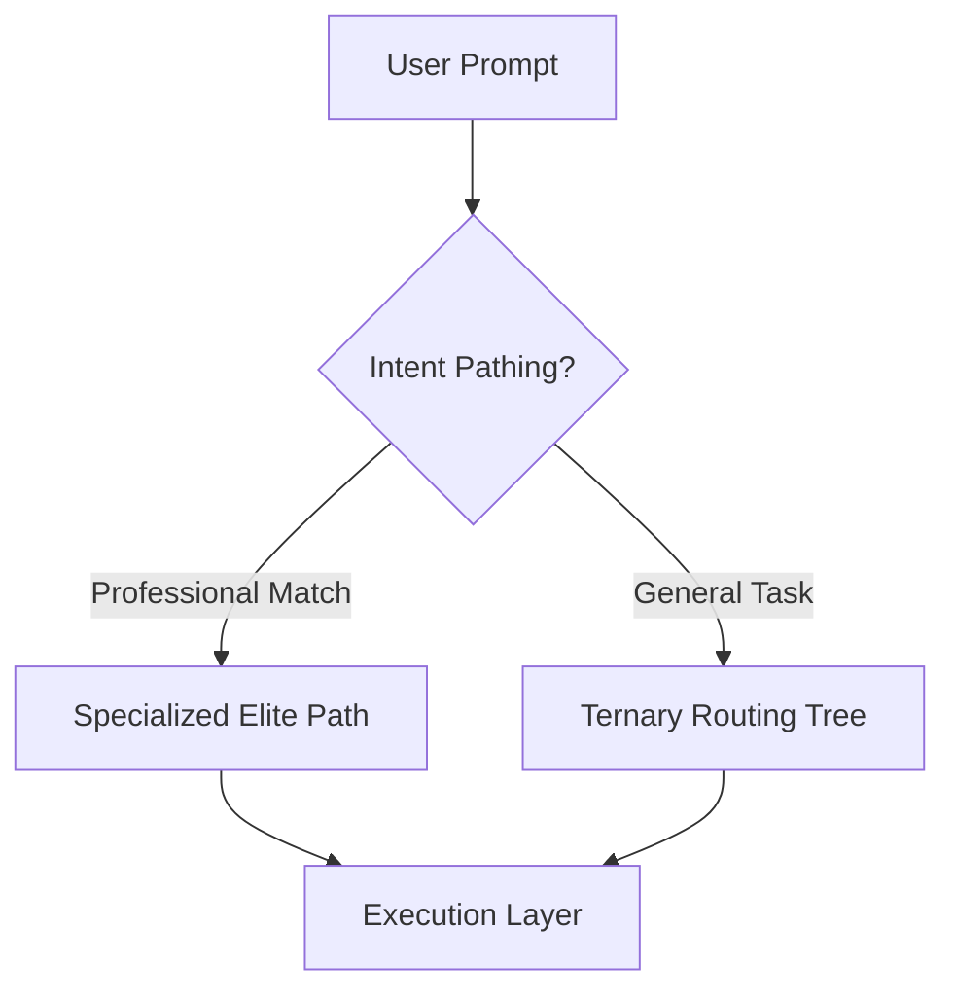

# 🌳 Ternary Binary Decision Tree - Visual Guide

> "Ternary decisions guide the system until they must collapse into binary execution paths."

## 🎭 The Philosophy: Layered Reality
The design of the routing system is built on the principle of **deferring collapse**. We maintain high-nuance, non-binary states as long as possible before committing to immutable physical actions.

### Layer 2: Intent Pathing (Elite Pre-Routing)
This is the "Purpose" layer. Before the tree assesses general complexity, we check for specialized domain intents.
- **Match Found**: Short-circuit the tree and route directly to an "Elite" specialized model (e.g., Sora 2 for Video).
- **No Match**: Defer to the standard Ternary Tree for general orchestration.

### Layer 1: Cognitive Routing Space (Ternary)
This is the "Thinking" layer. We use `-1`, `0`, and `+1` to describe a spectrum of intent for non-specialized tasks.
- **-1 (De-escalate)**: Favor speed and locality. High confidence in low complexity.
- **0 (Balanced)**: Informed by context and recent history. Seeking mid-tier stability.
- **+1 (Escalate)**: Escalating for deep architectural reasoning or massive context volume.

### Layer 0: Physical Execution Substrate (Binary)
This is the "Acting" layer. Reality is Boolean and irreversible.
- **Available / Unavailable**: Is Ollama running?
- **Success / Failure**: Did the CLI command exit 0?
- **Open / Closed**: Has the circuit breaker tripped?
- **Commit / Rollback**: Did the Sandbox save the changes?

---

## Tree Structure (Decision DAG)
This is technically a **Ternary Decision Directed Acyclic Graph (DAG)** with short-circuiting logic.

### 1. Intent Pre-Routing (Short-Circuit)


### 2. General Routing Path
                        ROOT: Assess Complexity
                        (prompt analysis)
                    /           |              \
                  -1            0              +1
               Simple        Medium          Complex
                  |             |               |
                  ▼             ▼               ▼
          ┌─────────────┐  ┌─────────────┐  ┌─────────────┐
          │Local Models?│  │Perf History?│  │Supervisor?  │
          └─────────────┘  └─────────────┘  └─────────────┘
           /    |    \       /    |    \       /    |    \
         -1     0    +1    -1     0    +1    -1     0    +1
          │     │     │     │     │     │     │     │     │
          ▼     ▼     ▼     ▼     ▼     ▼     ▼     ▼     ▼
    ┌────────────────────────────────────────────────────────┐
    │               LEAF NODES (MODEL SELECTION)             │
    ├────────────────────────────────────────────────────────┤
    │  qwen    yi-      qwen   gemini gemini qwen   gemini gemini│
    │  7b      9b       14b    flash  thinking 7b   flash  thinking│
    └────────────────────────────────────────────────────────┘
```

## 🧠 Supervisor-Worker Orchestration
The Ternary Tree no longer acts in isolation. It is now part of a **Supervisor-Worker** loop.

1. **Planning (Supervisor)**: A reasoning model (Gemini 2.0 Flash) analyzes the task and builds a steps checklist.
2. **Routing (Ternary Tree)**: For each step, the tree selects the optimal model (Ollama or Gemini).
3. **Execution (Worker)**: The selected model executes the specialized step (Research, Code, Test).
4. **Learning (RAG)**: Successes/Failures are recorded in `VectorDB` to influence future Level 2B (Performance History) decisions.
```

## Decision Criteria Details

### Level 1: Complexity Assessment (-1, 0, 1)

```javascript
function assessComplexity(context) {
  let score = 0;
  
  // Word count
  if (wordCount > 50) score++;
  
  // Multi-step indicator
  if (/then|after|next/.test(prompt)) score++;
  
  // Architecture keywords
  if (/design|architect|system/.test(prompt)) score += 2;
  
  // Multi-file indicator
  if (/files|modules|components/.test(prompt)) score++;
  
  // File size
  if (fileSize > 10000) score++;
  
  // Return ternary decision
  if (score >= 4) return +1;  // Complex
  if (score >= 2) return 0;   // Medium
  return -1;                  // Simple
}
```

**Examples:**

| Prompt | Score | Complexity | Branch |
|--------|-------|------------|--------|
| "fix typo in line 42" | 0 | Simple | -1 (left) |
| "refactor this function for better readability" | 2 | Medium | 0 (center) |
| "design microservices architecture with event sourcing and CQRS" | 5 | Complex | +1 (right) |

### Level 2A: Local Model Availability (Simple path)

```javascript
function checkLocalAvailability(context) {
  const available = context.availableModels.filter(m => m.type === 'local');
  const total = ALL_LOCAL_MODELS.length;
  const ratio = available.length / total;
  
  if (ratio >= 0.8) return +1;  // Most available
  if (ratio >= 0.4) return 0;   // Some available
  return -1;                    // Few available
}
```

**Example:**
- 4 out of 4 local models running → +1 → `qwen2.5-coder:14b` (fastest)
- 2 out of 4 local models running → 0 → `codellama:13b` (backup)
- 0 out of 4 local models running → -1 → `gemini-free` (cloud fallback)

### Level 2B: Performance History (Medium path)

```javascript
function checkPerformanceHistory(context) {
  const relevant = history.filter(
    p => p.taskType === context.taskType && 
         p.extension === context.extension
  );
  
  if (relevant.length === 0) return 0; // No history
  
  const avgLatency = average(relevant.map(p => p.latency));
  const successRate = relevant.filter(p => p.success).length / relevant.length;
  
  if (successRate > 0.9 && avgLatency < 2000) return +1;  // Excellent
  if (successRate > 0.7 && avgLatency < 5000) return 0;   // Average
  return -1;                                               // Poor
}
```

**Example:**
- Previous TypeScript tasks: 95% success, 300ms avg → +1 → `deepseek-coder:33b`
- Previous TypeScript tasks: 75% success, 4000ms avg → 0 → `qwen2.5-coder:14b`
- Previous TypeScript tasks: 50% success, 8000ms avg → -1 → `phi3:14b`

### Level 2C: Supervisor Requirement (Complex path)

In the present state, "+1" (Complex) prompts always trigger the **Supervisor Planning Turn**. The tree then branches based on whether the task requires deep architectural reasoning versus high-volume code generation.

```javascript
function checkSupervisorNeeds(context) {
  const containsArchitecture = /design|architect|refactor|system/.test(context.prompt);
  const isLargeModule = context.fileSize > 20000;
  
  if (containsArchitecture && isLargeModule) return +1; // Gemini Thinking
  if (isLargeModule) return 0;                          // Gemini Flash (Context King)
  return -1;                                           // DeepSeek (Local Power)
}
```

**Example:**
- "Fix this bug" → ROOT(-1) → qwen
- "Refactor this 1000-line class" → ROOT(+1) → Supervisor(+1) → Gemini Thinking
- "Scaffold a new Next.js app" → ROOT(+1) → Supervisor(0) → Gemini Flash

## 📡 Proactive RAG Integration
The decision tree is now "informed" by the state of the **VectorDB**.

- **Level 2B (History)** is now backed by `VectorDB.searchSimilar`.
- If the agent has failed a similar task before (recorded in `VectorDB` with `status: failed`), the tree automatically penalizes the model that failed and forces a higher-tier selection.

## Complete Routing Examples

### Example 1: Simple Syntax Fix

```
User: "fix syntax error in hello.ts"

Step 1: Assess Complexity
  - Word count: 5 (no score)
  - Multi-step: No
  - Architecture: No
  - Multi-file: No
  - Total score: 0
  → Decision: -1 (Simple)

Step 2: Check Local Availability
  - 4/4 Ollama models running
  - Ratio: 1.0
  → Decision: +1 (All available)

Step 3: Select Model
  - Path: ROOT(-1) → LocalAvail(+1)
  → Model: qwen2.5-coder:14b
  
Routing complete: 342ms to solution
```

### Example 2: Complex Architecture Task

```
User: "Design a microservices architecture for e-commerce platform with 
      API gateway, service mesh, event sourcing, and CQRS pattern. Include 
      detailed component diagrams and communication flows."

Step 1: Assess Complexity
  - Word count: 24 (+1)
  - Multi-step: "and" implies steps (+1)
  - Architecture: "microservices", "architecture", "pattern" (+2)
  - Multi-file: "components" (+1)
  - Total score: 5
  → Decision: +1 (Complex)

Step 2: Check Model Capacity
  - Estimated tokens: ~400
  - High capacity models available: yes
  - Prompt complexity requires reasoning
  → Decision: 0 (Medium capacity sufficient)

Step 3: Check Task Type
  - Task: Architecture
  → Decision: +1 (Specialized task)

Step 4: Select Model
  - Path: ROOT(+1) → Capacity(0) → TaskType(+1)
  → Model: deepseek-coder:33b
  
Routing complete: 1247ms to detailed architecture
```

### Example 3: Medium Refactoring with History

```
User: "Refactor this TypeScript class to use dependency injection"

Step 1: Assess Complexity
  - Word count: 8
  - Multi-step: No
  - Architecture: No
  - Multi-file: No
  - File referenced: 350 lines
  - Total score: 1
  → Decision: 0 (Medium)

Step 2: Check Performance History
  - Previous TypeScript refactors:
    - qwen: 87% success, 450ms avg
    - deepseek: 94% success, 520ms avg
    - phi3: 76% success, 800ms avg
  → Decision: +1 (Excellent history)

Step 3: Check Circuit Health
  - All circuits: CLOSED
  → Decision: +1 (Healthy)

Step 4: Select Model
  - Path: ROOT(0) → PerfHist(+1) → CircuitHealth(+1)
  → Model: deepseek-coder:33b
  
Routing complete: 489ms to refactored code
```

## Circuit Breaker Integration

```
┌─────────────────────────────────────────────┐
│  Ternary Tree selects: deepseek-coder:33b  │
└─────────────────────────────────────────────┘
                    │
                    ▼
        ┌───────────────────────┐
        │ Check Circuit Breaker │
        └───────────────────────┘
         /           |            \
    CLOSED       HALF_OPEN        OPEN
       │             │              │
       ▼             ▼              ▼
  Use model    Try model      Use fallback
                    │              │
                    ▼              ▼
             ┌─────────┐    qwen2.5-coder:14b
             │Success? │           │
             └─────────┘           │
              /      \             │
            Yes      No            │
             │        │            │
             ▼        ▼            ▼
          CLOSED    OPEN      (recursive check)
```

## Performance Characteristics

### Time Complexity

```
Linear Selection (old):
  O(n) where n = number of models
  9 models = 9 comparisons worst case

Ternary Tree (new):
  O(log₃ n) where n = number of models
  9 models = 2-3 comparisons worst case

Speedup: 3-4.5x for 9 models
```

### Space Complexity

```
Linear: O(1) - no extra storage
Ternary Tree: O(log n) - recursion stack

Trade-off: Minimal space for significant speed gain
```

Result: Better model selection = higher success rate. The tree protects the binary execution layer from "vibes" by enforcing measured control theory before process invocation.

## 🚀 Future-Proofing (The Horizon)
While the present heuristic-based tree is highly performant (cheap, explainable, debuggable), the system is designed to evolve:

1. **Semantic Signals**: We plan to introduce a "Reasoning Depth" score from the VectorDB to detect semantically dense, high-complexity prompts that are short in word count.
2. **Regret Tracking**: We will begin measuring "Opportunity Cost"—tracking if a higher-tier model would have succeeded where a lower-tier model failed, allowing for automated threshold tuning.
3. **Decoupled Context**: Future iterations will split the "Supervisor +1" branch into "Reasoning Depth (Thinking)" vs "Context Volume (Memory)" to better utilize large-context models like Gemini Flash.

## Tuning Guide

### Adjust Complexity Thresholds

```typescript
// In Router.ts, modify assessComplexity()

// More aggressive (prefers complex models)
if (score >= 3) return 1;  // Was: 4
if (score >= 1) return 0;  // Was: 2

// More conservative (prefers simple models)
if (score >= 5) return 1;  // Was: 4
if (score >= 3) return 0;  // Was: 2
```

### Adjust Circuit Breaker

```typescript
// In config
circuitBreakerThreshold: 5,   // Allow more failures
circuitBreakerCooldown: 60000  // Wait longer before retry
```

### Custom Tree

```typescript
// Replace decision tree entirely
const customTree: TernaryNode = {
  kind: 'branch',
  description: 'Custom priority logic',
  condition: (ctx) => {
    if (ctx.prompt.includes('urgent')) return 1;
    if (ctx.prompt.includes('simple')) return -1;
    return 0;
  },
  left: { kind: 'leaf', modelName: 'qwen2.5-coder:7b-instruct-q4_K_M' },
  center: { kind: 'leaf', modelName: 'yi-coder:9b-chat-q5_K_M' },
  right: { kind: 'leaf', modelName: 'gemini-flash' }
};
```

---

**Ternary Binary Trees: Because -1, 0, and 1 are all you need to rule the model routing world.** 🌳⚡
